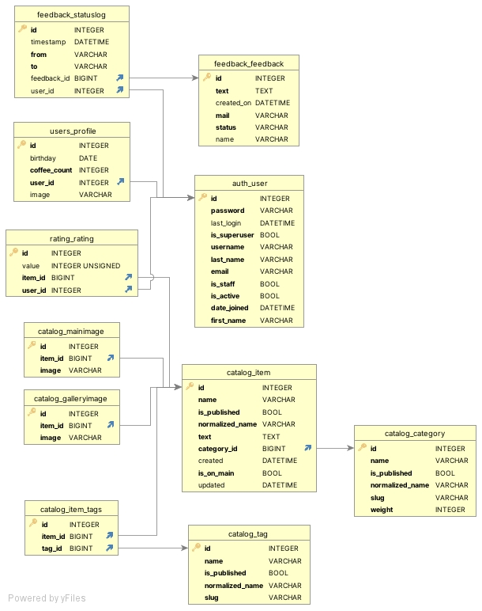

# How to get started with the application 📝

## Run the app 🚀

To run the app locally, follow these steps:

1. Clone the repository: `git clone {repository_url}`
2. Navigate to the project directory: `cd dashboard`
3. Create and activate a virtual environment:
   - Linux/macOS: `python -m venv venv && source venv/bin/activate`
   - Windows: `python -m venv venv && venv\Scripts\activate`
4. Install the main dependencies for production: `pip install -r requirements/prod.txt`
5. Set up your database: `python manage.py migrate`
6. Create a superuser: `python manage.py createsuperuser`
7. Create a `.env` file in the root of your project and define your environment variables (see below for example variables)
8. Load environment variables in your Python code
9. Run the development server: `python manage.py runserver`
10. Access the app at [http://127.0.0.1:8000/](http://127.0.0.1:8000/) in your browser.

## Environment Variables

Define the variables of your virtual environment. An example is the file `config.env`

## Managing Translations 🌐

1. Create translation files: `django-admin manage.py makemessages -l 'language'`
2. Edit translation files: Use a text editor to modify the `.po` files and add translations for the strings.
3. Compile translation files: `django-admin manage.py compilemessages`

## Database

To successfully launch the application, you will need a database. It is provided as part of the test application in the repository files. To run an application using a test database, follow several conditions:

1. Create a superuser: `python manage.py createsuperuser`
2. additionally perform migrations: `python manage.py migrate`

## ER Diagram

Here is a visual ER diagram of the existing project database

## Contribution 🔥

Thank you for your interest in this repository! Your contributions are highly appreciated. If you encounter any issues or have suggestions, please feel free to create an issue or pull request. We hope this app aids in your understanding and experience.

**Note**: This app is intended as a demonstration and might not be suitable for production use without further modifications and security considerations.
